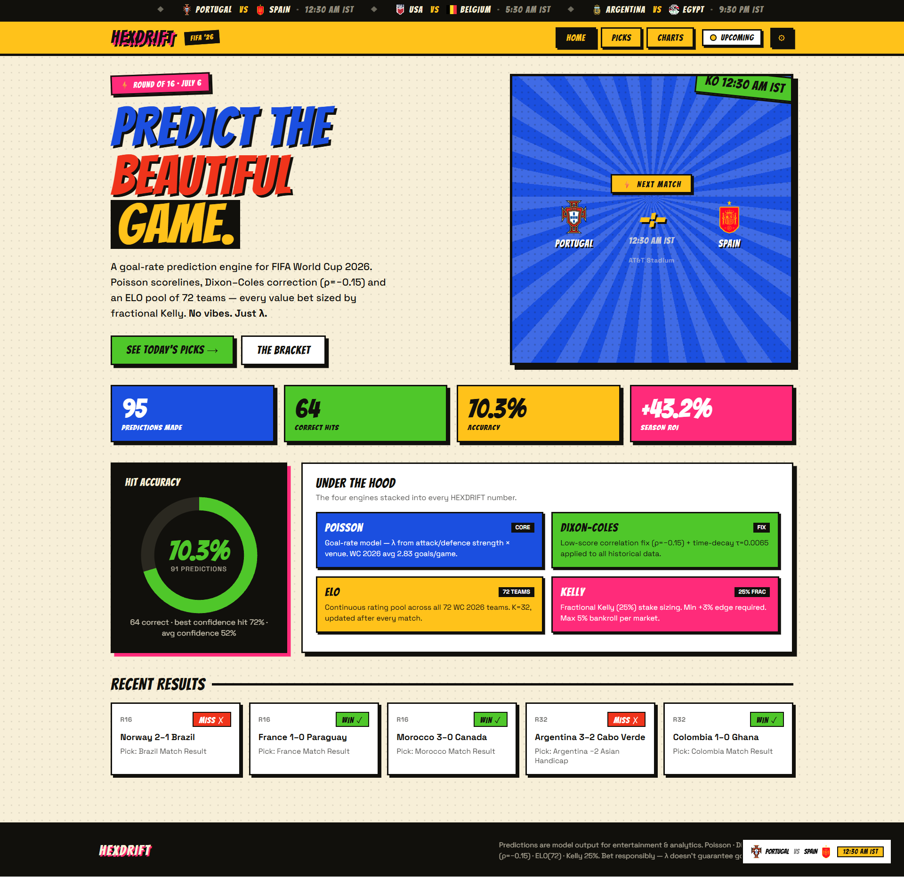

<div align="center">


<br/>


# HEXDRIFT
### FIFA World Cup 2026 Match Predictor

**A goal-rate prediction engine for FIFA World Cup 2026.** Poisson scorelines, Dixon-Coles correction (ρ=−0.15), and an ELO pool of 72 teams — every value bet sized by fractional Kelly. **No vibes. Just λ.**

[](https://sarthak-rautela.github.io/FIFA-World-Cup-2026-Match-Predictor/)
[](https://github.com/SARTHAK-RAUTELA/prediction-Testing/actions/workflows/update-match-results.yml)
[](https://github.com/SARTHAK-RAUTELA/prediction-Testing/actions/workflows/update-golden-boot.yml)
[](https://www.python.org/)

**🔗 [sarthak-rautela.github.io/FIFA-World-Cup-2026-Match-Predictor](https://sarthak-rautela.github.io/FIFA-World-Cup-2026-Match-Predictor/)**

<br/>

<!-- STAT STRIP — mirrors the live site's home-page stat cards -->
<table>
<tr>
<td></td>
<td></td>
<td></td>
<td></td>
</tr>
</table>



<sub>The live site tracks its own record in public — accuracy and ROI update automatically as matches finish (see <a href="#automation--self-updating-site">Automation</a> below).</sub>

</div>

<br/>

<!-- UNDER THE HOOD — same 2×2 engine grid as the site's homepage -->
<table align="center">
<tr>
<td width="50%">


<br/>Goal-rate model — λ from attack/defense strength × venue. WC 2026 avg **2.83 goals/game**.

</td>
<td width="50%">


<br/>Low-score correlation fix, **ρ = −0.15**, recalibrated from 72 group-stage games.

</td>
</tr>
<tr>
<td width="50%">


<br/>Continuous rating pool across all 72 WC 2026 teams, updated after every match.

</td>
<td width="50%">


<br/>Fractional Kelly (25%) stake sizing. Min +3% edge required, max 5% of bankroll.

</td>
</tr>
</table>

---

<!--
  More views of the site (Picks page, Bracket/Charts page, Live match tracker) go here.
  Drop additional screenshots into docs/screenshots/ (e.g. picks.png, charts.png) and
  reference them with the same  pattern as above.
-->

## Table of Contents

- [Overview](#overview)
- [The Live Website (HEXDRIFT)](#the-live-website-hexdrift)
- [Automation — Self-Updating Site](#automation--self-updating-site)
- [Three Ways to Use This Project](#three-ways-to-use-this-project)
- [How It Works](#how-it-works)
  - [Data Collection Layer](#data-collection-layer)
  - [Mathematical Models](#mathematical-models)
  - [Prediction Markets](#prediction-markets)
  - [Confidence Scoring](#confidence-scoring)
  - [Kelly Criterion Stakes](#kelly-criterion-stakes)
  - [Live Monitoring](#live-monitoring)
- [Project Structure](#project-structure)
- [Setup](#setup)
- [Usage](#usage)
- [Configuration](#configuration)
- [Model Weights](#model-weights)
- [ELO Ratings](#elo-ratings)
- [Confidence Levels](#confidence-levels)
- [Caching](#caching)
- [Disclaimer](#disclaimer)

---

## Overview

This repo is a full pipeline for predicting FIFA World Cup 2026 match outcomes with a composite mathematical model — ELO ratings, Poisson goal distribution, Dixon-Coles correction, recent form, player-impact adjustments, and live lineup/odds data — then turning those numbers into staked betting recommendations via fractional Kelly.

It ships in three forms:

1. **[HEXDRIFT](https://sarthak-rautela.github.io/FIFA-World-Cup-2026-Match-Predictor/)** — a public, self-grading static website hosted on GitHub Pages (`docs/`)
2. **A Streamlit web dashboard** (`app.py`) — the full interactive model with live match tracking, for local use
3. **A Python CLI** (`main.py` / `launcher.py`) — terminal output with Rich-formatted prediction panels

All three run on the same prediction engine in `prediction/engine.py`.

For each match, the model predicts:

| Market | Description |
|--------|-------------|
| **1X2** | Home win / Draw / Away win |
| **BTTS** | Both Teams to Score (full time, 1st half, 2nd half) |
| **Asian Handicap** | Spread-adjusted win probability, per line |
| **Asian Total** | Over/Under goal totals, per line |
| **Total Goals — Exact** | Exact goal-count distribution |
| **Draw No Bet (DNB)** | 1X2 with the draw refunded |
| **Double Chance** | Home/Draw, Away/Draw, Home/Away |
| **Correct Score** | Ranked exact scorelines |
| **Clean Sheet** | Either team to keep a clean sheet |
| **First Goal** | Which team scores first |
| **Half-Time Result / HT-FT** | 1X2 at half time, and the HT→FT combo grid |
| **Goalscorer** | Anytime and first-goalscorer odds per player |
| **KO Qualify (inc. ET + Pens)** | Knockout-stage progression probability, penalty-shootout rate factored in |

It also flags **value bets** by comparing model probability against bookmaker odds (pulled live from Sofascore or entered manually), and sizes each one with **fractional Kelly** staking.

---

## The Live Website (HEXDRIFT)

`docs/index.html` is a single self-contained static page (all CSS/JS inline, no build step) deployed via GitHub Pages at **https://sarthak-rautela.github.io/FIFA-World-Cup-2026-Match-Predictor/**.

| Page | What it shows |
|------|---------------|
| **Home** | Hero match card for the next kickoff, a live stat strip (predictions made, correct hits, accuracy %, season ROI), a "Hit Accuracy" ring chart, the four-engine "Under the Hood" breakdown, and a recent-results feed |
| **Picks** | Every prediction the model has made this tournament, with market, selection, edge %, and win/miss grading once the match finishes |
| **Charts** | The knockout bracket view |
| **Live widget** | A floating tracker that follows in-progress matches (score, minute, live odds movement) |
| **Settings (⚙)** | Client-side entry for personal API keys, if you want to point the page at your own data sources |

The predictions themselves live directly in `docs/index.html` as a `const ALL_PREDS = [...]` array, and the Golden Boot leaderboard lives in `docs/data/golden_boot.json`. Both are rewritten automatically — see below.

---

## Automation — Self-Updating Site

Two GitHub Actions workflows keep the live site current with **no manual intervention**:

| Workflow | Schedule | What it does |
|----------|----------|--------------|
| [`update-match-results.yml`](.github/workflows/update-match-results.yml) |  | Runs [`scripts/update_match_results.py`](scripts/update_match_results.py): finds `"upcoming"` picks in `docs/index.html`, checks football-data.org for a finished score on that fixture, fills in the real result, and grades the pick correct/wrong/push. Commits and pushes straight to `main` if anything changed. |
| [`update-golden-boot.yml`](.github/workflows/update-golden-boot.yml) |  | Runs [`scripts/update_golden_boot.py`](scripts/update_golden_boot.py): refreshes the top-scorer leaderboard into `docs/data/golden_boot.json`. Commits and pushes if changed. |

Because grading happens automatically, the **accuracy %**, **correct hits**, and **season ROI** numbers on the live site are a real, continuously-updated track record — not a static claim. Both jobs authenticate to football-data.org with `FOOTBALL_DATA_API_KEY` stored as a GitHub Actions secret, and commit as `github-actions[bot]`.

---

## Three Ways to Use This Project

### 1. The live website — no setup

Just open **[sarthak-rautela.github.io/FIFA-World-Cup-2026-Match-Predictor](https://sarthak-rautela.github.io/FIFA-World-Cup-2026-Match-Predictor/)**. It's a static page reading pre-computed picks — nothing to install.

### 2. Streamlit web dashboard — full interactive model, local

```bash
streamlit run app.py
# or double-click FIFA_Web.bat on Windows
```

Lets you pick any fixture, tune the bankroll and tournament stage, see every market tab (Main, Goals, Asian Lines, Half, Goalscorers), a live match tracker, and the Kelly Criterion staking card — all computed live against your own API keys.

### 3. CLI — terminal output

```bash
python main.py
# or double-click FIFA_Predictor.bat on Windows
```

Rich-formatted prediction panels straight in the terminal, with `--watch` mode for live lineup polling.

---

## How It Works

### Data Collection Layer

Each collector in `collectors/` inherits from `BaseCollector` (`collectors/base_collector.py`), which provides rate limiting, exponential-backoff retry (respecting `Retry-After` on 429s), and a shared thread-safe TTL cache (`data/cache.py`). A `DataAggregator` (`collectors/data_aggregator.py`) fans out requests across all sources and merges the results.

| Collector | Source | Data provided |
|-----------|--------|---------------|
| `ESPNCollector` | ESPN public API (no key) | Fixtures, lineups, live scores, team form |
| `SportsDbCollector` | TheSportsDB (free key `"3"`) | Match details, player stats |
| `SofascoreCollector` / `LiveMatchCollector` | sportapi7.p.rapidapi.com | Confirmed starting XIs, formations, live score/stats/commentary, 5-market bookmaker odds |
| `FootballDataCollector` | api.football-data.org | WC fixtures, standings, form, final results (used by the results-grading workflow) |
| `APIFootballCollector` | api-football-v1.p.rapidapi.com | Team stats, H2H records |
| `NewsCollector` | NewsAPI + GNews | Injury news, team sentiment |
| `WeatherCollector` | Open-Meteo (no key) | Match-day weather at the venue city |
| `WorldCup26Collector` / `WcResultsCollector` / `FootballStandingsCollector` | Free public sources | Tournament schedule, group tables, live standings |

### Mathematical Models

**1. ELO Rating Model** (`models/elo_model.py`) — pre-seeded ratings for all 72+ qualified teams (e.g. Argentina 2095, France 2065, Brazil 2045, England 2025).

```
expected_score(A, B) = 1 / (1 + 10^((ELO_B - ELO_A - home_bonus) / 400))
draw_probability      = max(0.10, 0.28 × exp(-|ELO_diff| / 600))

home_xG = avg_goals × (0.4 + 0.5 × expected_score)
away_xG = avg_goals × (0.4 + 0.5 × (1 - expected_score))
```

All WC 2026 venues (USA/Canada/Mexico) are treated as neutral, so the +100-point home-advantage bonus is suppressed. Ratings update after every match (goal-difference multiplier + stage-based K-factor, 40 for group stage up to 65 for the final) and persist to `data/elo_state.json`.

**2. Poisson Goal Distribution** — given home/away λ from the ELO/form composite, the full score matrix is computed up to `MAX_GOALS` (8) goals per side:

```
P(team scores n goals) = e^(-λ) × λ^n / n!
```

**3. Dixon-Coles Correction** — low-scoring outcomes are corrected with `ρ = -0.15` (recalibrated from the 72 completed group-stage games, observed avg. 2.83 goals/match):

```
P(0,0) ×= 1 - λ_home·λ_away·ρ      P(1,0) ×= 1 + λ_away·ρ
P(1,1) ×= 1 - ρ                    P(0,1) ×= 1 + λ_home·ρ
```

**4. Form Analyzer** (`models/form_analyzer.py`) — a recency-weighted score from each team's last 5–10 results, blended into the base λ.

**5. Player Impact Model** (`models/player_impact.py`) — reduces attack/defense multipliers (capped at 35%/30%) when a key player is confirmed absent from the lineup or named in injury news.

**6. Goalscorer Model** (`models/goalscorer_model.py`) — per-player Poisson goal probability from each team's λ, weighted by known scoring shares (boosted for Golden Boot contenders — e.g. +8% for 6-goal scorers).

**7. Knockout-Stage Adjustment** (`models/composite_model.py`) — knockout football is tighter than group-stage football, so λ is scaled down progressively the deeper the round goes (R32/R16 ×0.90, QF ×0.88, SF/Final ×0.87), and the bookmaker-blend weight rises to 62% (vs. 55% in the group stage) to lean more on market pricing where the model has less historical signal.

**8. Composite Model** — the signals above are blended with the weights in [Model Weights](#model-weights).

### Prediction Markets

All markets are derived from the full score matrix (see [`prediction/markets.py`](prediction/markets.py)):

```
P(home win) = Σ P(h,a) for h > a          BTTS Yes = P(home ≥ 1) × P(away ≥ 1)
P(draw)     = Σ P(h,a) for h = a          Over 2.5 = Σ P(h,a) for h+a > 2
P(away win) = Σ P(h,a) for h < a
```

**Value bet detection** flags a market when:

```
model_probability > (1 / bookmaker_odds) × 1.03      # 3% edge over the bookmaker's margin
```

### Confidence Scoring

Computed in [`prediction/confidence.py`](prediction/confidence.py) from ELO gap, lineup-confirmation status, form-data availability, cross-source agreement, and news sentiment.

Typical ranges: **~29%** with no lineup data · **~45%** unconfirmed Sofascore lineup · **~50–55%** confirmed lineup · **93%+** extreme favorites with confirmed lineups. The default `MIN_CONFIDENCE_THRESHOLD` is **93%** — predictions below it show a summary line only (`--all` or `--threshold N` overrides this on the CLI).

### Kelly Criterion Stakes

[`prediction/stakes_analyzer.py`](prediction/stakes_analyzer.py) turns value bets into sized stakes using **fractional Kelly (25%)**:

- `kelly_fraction()` / `stake_amount()` / `expected_profit()` — position sizing off model edge and bankroll
- `penalty_shootout_probability()` — P(90-min draw) × 0.43 historical WC rate → P(going to pens)
- KO qualify markets fold in extra-time + penalty 50/50 splits
- Guardrails: `MIN_EDGE_PCT = 3.0%`, `MAX_STAKE_PCT = 5.0%` of bankroll, `MIN_STAKE_AMOUNT = $1.00`

### Live Monitoring

`LiveMonitor` (`collectors/live_monitor.py`) polls for lineup changes on an adaptive schedule and re-runs the prediction when the starting XI changes:

| Time to kickoff | Poll interval |
|-----------------|--------------|
| > 2 hours | 120s |
| 30 min – 2 hours | 60s |
| < 30 minutes | 30s |
| Match started | 300s |

`collectors/live_collector.py` + `models/live_model.py` power the in-play tracker in the Streamlit app and the live widget on the website: live score, event timeline, statistics, commentary, and a re-computed in-play 1X2/next-goal market as the match progresses.

---

## Project Structure

```
prediction-Testing/
├── main.py                       # CLI entry point (argparse)
├── launcher.py                   # Interactive double-click launcher
├── app.py                        # Streamlit web dashboard
├── export_predictions.py         # Writes docs/predictions_export.json for the static site
├── config.py                     # All settings, ELO ratings, model weights, KO adjustments
├── FIFA_Predictor.bat            # Windows CLI launcher
├── FIFA_Web.bat                  # Windows Streamlit launcher
│
├── collectors/                   # ESPN, Sofascore, football-data.org, API-Football,
│                                  # NewsAPI/GNews, Open-Meteo, live match data, aggregator
├── models/                       # ELO, Poisson, Dixon-Coles composite, form, player
│                                  # impact, goalscorer, live in-play model
├── prediction/                   # engine.py (orchestrator), markets.py, confidence.py,
│                                  # stakes_analyzer.py (Kelly Criterion)
├── display/                      # Rich terminal tables, panels, alerts
├── data/                         # cache.py, elo_state.json, team_analysis.json,
│                                  # fifa_2026_results.json
│
├── docs/                         # ← GitHub Pages site (HEXDRIFT)
│   ├── index.html                #   self-contained site incl. ALL_PREDS picks array
│   ├── data/golden_boot.json     #   top-scorer leaderboard (auto-updated)
│   ├── screenshots/              #   README preview images
│   └── predictions_export.json   #   engine output consumed by the site
│
├── scripts/
│   ├── update_match_results.py   # Grades finished picks — run by GitHub Actions
│   └── update_golden_boot.py     # Refreshes golden boot data — run by GitHub Actions
│
├── .github/workflows/            # update-match-results.yml, update-golden-boot.yml
├── requirements.txt
├── .env                          # API keys (not committed)
└── .env.example                  # Key names + registration links
```

---

## Setup

### Requirements

- Python 3.11+
- Windows (for the `.bat` launchers; everything else runs on any OS)

### Installation

```bash
git clone https://github.com/SARTHAK-RAUTELA/prediction-Testing.git
cd prediction-Testing

python -m venv .venv
.venv\Scripts\activate        # Windows

pip install -r requirements.txt
copy .env.example .env        # then fill in your keys
```

### API Keys

| Variable | Source | Free tier |
|----------|--------|-----------|
| `FOOTBALL_DATA_API_KEY` | [football-data.org](https://www.football-data.org/client/register) | Unlimited WC access |
| `API_FOOTBALL_KEY` | [RapidAPI — api-football](https://rapidapi.com/api-sports/api/api-football) | 100 req/day (also powers Sofascore endpoints) |
| `NEWS_API_KEY` | [newsapi.org](https://newsapi.org/register) | 100 req/day |
| `GNEWS_API_KEY` | [gnews.io](https://gnews.io/) | 100 req/day |
| `SPORTS_DB_API_KEY` | TheSportsDB | Use `3` for free tier |

ESPN and Open-Meteo need no key. The live site's own automation only needs `FOOTBALL_DATA_API_KEY`, set as a repo secret.

---

## Usage

### CLI

```bash
python main.py                                     # today's matches
python main.py --date 2026-07-10                   # a specific date
python main.py --match "USA" "Paraguay"             # one fixture
python main.py --match "France" "Brazil" --odds     # enter bookmaker odds for value-bet detection
python main.py --all                                 # ignore the confidence threshold
python main.py --threshold 40                        # lower the threshold
python main.py --watch                                # keep polling for lineup changes
```

### Streamlit dashboard

```bash
streamlit run app.py
```

Pick a fixture or "Today's Matches" mode, set the tournament stage and bankroll in the sidebar, and every market tab renders with live odds where available.

### Static site

Nothing to run — it's already live and self-updating (see [Automation](#automation--self-updating-site)). To regenerate its data payload locally: `python export_predictions.py`.

---

## Configuration

| Setting | Default | Description |
|---------|---------|-------------|
| `MIN_CONFIDENCE_THRESHOLD` | `93.0` | Below this %, CLI shows a summary line only |
| `DIXON_COLES_RHO` | `-0.15` | Low-score correlation correction |
| `WC2026_OBSERVED_AVG_GOALS` | `2.83` | Recalibrated from the 72 completed group-stage matches |
| `KO_LAMBDA_REDUCTION` | `0.90` | xG multiplier applied from Round of 32 onward |
| `GROUP_BOOKMAKER_BLEND` / `KO_BOOKMAKER_BLEND` | `0.55` / `0.62` | Weight given to bookmaker pricing, group stage vs. knockout |
| `HOME_ADVANTAGE_FACTOR` | `1.15` | ELO home bonus (suppressed — all WC 2026 venues are neutral) |
| `MAX_GOALS_PREDICTION` | `8` | Score-matrix size per team |
| `DATA_REFRESH_INTERVAL` | `300s` | General data refresh interval |
| `PRE_MATCH_REFRESH_INTERVAL` | `60s` | Refresh interval 1–2 hrs before kickoff |
| `LINEUP_REFRESH_INTERVAL` | `120s` | Default lineup poll interval |

---

## Model Weights

```python
MODEL_WEIGHTS = {
    "poisson":       0.40,   # Poisson score matrix
    "elo":           0.25,   # ELO win probability
    "form":          0.20,   # Recent 5–10 match form
    "player_impact": 0.10,   # Key player availability
    "sentiment":     0.05,   # News/injury sentiment
}
```

Adjustable in `config.py` without touching any model code.

---

## ELO Ratings

All 72+ teams are pre-seeded in `config.py` under `FIFA_2026_ELO_RATINGS`:

| Team | ELO | Region |
|------|-----|--------|
| Argentina | 2095 | CONMEBOL |
| France | 2065 | UEFA |
| Brazil | 2045 | CONMEBOL |
| England | 2025 | UEFA |
| Spain | 2015 | UEFA |
| Germany | 2000 | UEFA |
| Portugal | 1980 | UEFA |
| Mexico | 1880 | CONCACAF |
| USA | 1845 | CONCACAF |
| Morocco | 1840 | CAF |
| Japan | 1830 | AFC |

Ratings update automatically after each graded match and persist to `data/elo_state.json`.

---

## Confidence Levels

| Confidence | Meaning |
|------------|---------|
| ~29% | No lineup data — ELO + form only |
| ~45% | Unconfirmed lineup (Sofascore projection) |
| 50–55% | Confirmed starting XI |
| 93%+ | Extreme favorite, confirmed lineup — auto-displayed on the CLI |

---

## Caching

`DataCache` (`data/cache.py`) is an in-memory, thread-safe TTL cache shared across all collectors:

| Data type | TTL |
|-----------|-----|
| Fixtures | 1 hour |
| Lineups | 2 minutes |
| Form | 2 hours |
| H2H records | 24 hours |
| News | 30 minutes |
| Weather | 1 hour |
| Standings | 2 hours |
| Player stats | 4 hours |

Cache is per-session — restarting the tool clears it.

---

## Disclaimer

Predictions are model output for entertainment and analytics purposes — Poisson, Dixon-Coles, a 72-team ELO pool, and 25%-fractional Kelly sizing. λ doesn't guarantee goals. Bet responsibly, and never stake more than you can afford to lose.
